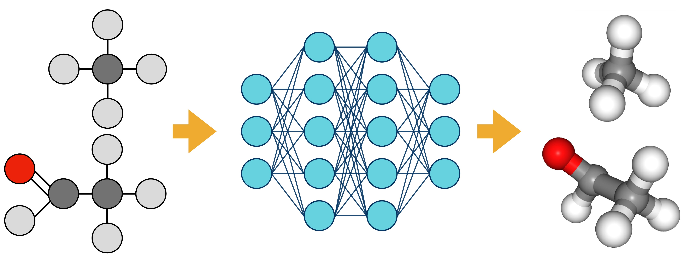

# transBG: A transferable Boltzmann Generator for small molecules



## Description
transBG is a deep-learning transferable generator of physically realistic conformers for small molecules. transBG is a Boltzmann Generator based on normalizing flows conditioned on a molecular representation. This model is auto-regressive and the position of the atoms in a molecule are generated using internal coordinates.

## Updates
The following versions of transBG exist in this repository:
* v1.b is the label corresponding to the first beta version.


## Prerequisites
* Anaconda or Miniconda with Python 3.9.
* CUDA-enabled GPU.

## Instructions and tutorials
### Setting the environment
The [./environments/transBG-env.yml](./environments/transBG-env.yml) file lists all the packages required for transBG to run. A virtual environment can be easily created using the YAML file and conda by typing into the terminal:

```
conda env create -f environments/transBG_env.yml
```

Then, to activate the environment:

```
conda activate transBG_env
```

### Usage
The two learning strategies, likelihood- and energy-based learning, can be performed using the script [submit_transBG.py](./submit_transBG.py). Jobs can be run using your local computer or SLURM.

The (hyper-)parameters and dataset paths/indexes can be specified at [./parameters.py](./parameters.py).

## Data
The sdf files corresponding to the QM9 dataset molecules can be downloaded using [./preprocessing/download_qm9.py](./preprocessing/download_qm9.py). However, the xyz-files are also needed. These latter can be downloaded from  [kaggle](https://www.kaggle.com/zaharch/quantum-machine-9-qm9?select=data.covs.pickle). Moreover, the conformations obtained by molecular dynamics simulations can be found at [./datasets/QM9/qm9_conformations](./datasets/QM9/qm9_conformations).

## Contributors
[@JuanViguera](https://www.github.com/JuanViguera) and [@psolsson](https://github.com/psolsson).

## Contributions
Contributions are welcome in the form of issues or pull requests. To report a bug, please submit an issue. Thank you to everyone who has used the code and provided feedback thus far.

## References
### Relevant publications
If you use transBG in your research, please reference our [not_yet_available](https://doi.org/not_yet_available).

The reference in BibTex format are available below:

```

```

transBG was initially developed in Juan Viguera Diez's Master's Thesis. His (and [Sara Romeo's](https://github.com/sararromeo) ) memmory can be found at

[memory](https://odr.chalmers.se/handle/20.500.12380/302827?mode=full).

### Related work
```
@Article {Boltzmann_gen,
	author = {No{\'e}, Frank and Olsson, Simon and K{\"o}hler, Jonas and Wu, Hao},
	title = {Boltzmann generators: Sampling equilibrium states of many-body systems with deep learning},
	volume = {365},
	number = {6457},
	elocation-id = {eaaw1147},
	year = {2019},
	doi = {10.1126/science.aaw1147},
	publisher = {American Association for the Advancement of Science},
	issn = {0036-8075},
	URL = {https://science.sciencemag.org/content/365/6457/eaaw1147},
	eprint = {https://science.sciencemag.org/content/365/6457/eaaw1147.full.pdf},
	journal = {Science}
}
```

## License
transBG is licensed under the MIT license and is free and provided as-is.

## Link
[https://github.com/olsson-group/transBG](https://github.com/olsson-group/transBG)
